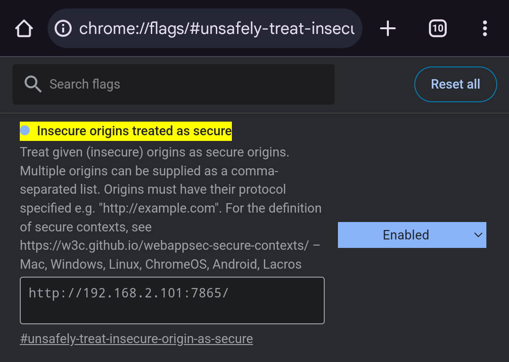

# Smartphone Keyboard Remote

Was unhappy finding a server-app combo, that lets me use my smartphone as a keyboard in my LAN.
Everything riddled with bugs and disconnection issues.
Also why trust someone elses encryption and secrecy, when you can fail to implement your stuff securely yourself.

## Hosted version

Hosted and installable (as a [PWA](https://web.dev/progressive-web-apps/)) under [https://jonas-kell.github.io/smartphone-keyboard-remote/#/](https://jonas-kell.github.io/smartphone-keyboard-remote/#/).


To make the hosted version work, you have to allow it in the settings of your browser.

Because the hosted version is `https` (so that you can have camera and PWA goodness in teh required `secure-context`).
The application has internal encryption with pre-shared keys, so that you do not require a `https-certificate` for your self-hosted server.
But modern browsers then block our (properly encrypted, but it doesn't know that) `http` requests, because of [`mixed content`](https://developer.mozilla.org/en-US/docs/Web/Security/Mixed_content) (https to http).

Following tutorials, one can [Disable this behavior](https://experienceleague.adobe.com/en/docs/target/using/experiences/vec/troubleshoot-composer/mixed-content).
Paste `chrome://flags/#unsafely-treat-insecure-origin-as-secure` into the chrome address-bar.
Enable the mixed content for your server ip only (you see it at the server start, !! include `http://` and `:7865`):


## Run the backend

```cmd
# make sure to have rust installed: https://www.rust-lang.org/tools/install

sudo apt-get install libxdo-dev

# make sure you have node installed: https://github.com/nvm-sh/nvm?tab=readme-ov-file#installing-and-updating

cd client
npm install
npm run build
cd ..
cd server
cargo build --release
```

## Dev the frontend

```cmd
# make sure you have node installed: https://github.com/nvm-sh/nvm?tab=readme-ov-file#installing-and-updating

cd client
npm install
npm run dev
```

## Dev the backend

```cmd
# make sure to have rust installed: https://www.rust-lang.org/tools/install

sudo apt-get install libxdo-dev

# make sure you have node installed: https://github.com/nvm-sh/nvm?tab=readme-ov-file#installing-and-updating

cd client
npm install
npm run build
cd ..
cd server
cargo watch -x "run dev"
```

<!--
https://cthedot.de/icongen/
https://realfavicongenerator.net/
 -->
